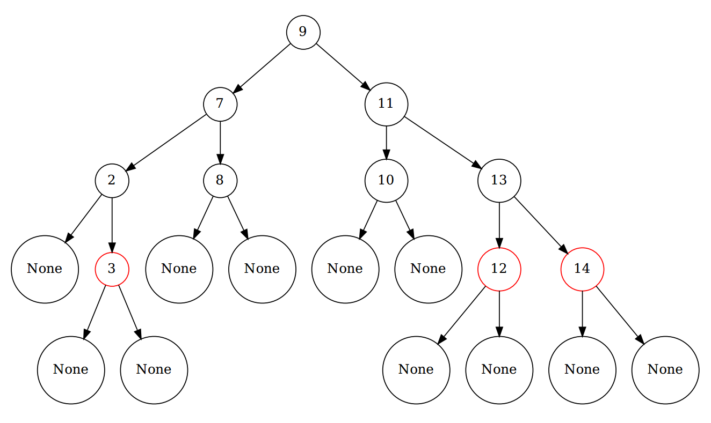

### Introduction 

This readme.md just guides you to run the script for RedBlackTree.py

### Prepration

Just install some libs which help visualize the RedBlackTree

>`sudo apt install graphviz`
>`sudo pip install graphviz`

And the version of Python should larger than 3.6 for the case of f-formating strings.

### Run

After installing all the libs, you can run the RedBlackTree.py by simple `python RedBlackTree.py`

### Result

The scirpt would generates a pdf under the folder. And you can see the visualization of the RedBlackTree in the file.
